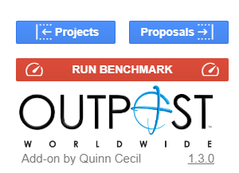

## Current State
With Version 1.2.2 released and in use there is already a large codebase to use as a start. Right now the Outpost project manager has two major sides, the Calendar side, and the Outpost Project Database Side. The calendar side looks at any selected calendar booking and tries to find the Reconciliation Sheet the employees use to log their work on. It simply serves as a quicker link to the sheet, you still need to log all your information manually. On the Outpost Project Database side, it will load whatever project you have selected, and find any information it can on that project, find the folder, the reconciliation sheet, the costing sheet, and the proposal document, and will present a link to anything it can find. It also facilitates making new projects and generating those documents automatically as well. 

#### The Next Update (Version 1.3)
On the agenda for the next update all revolve around making a more efficient system. Everything works as expected right now, but the app is quite slow. I figure by looking at exactly what is the slowest part of the app, and caching the information it is resolving, I can speed up the app as a whole. I think the slowest thing is just the calls to access the spreadsheet, so it should be as easy as saving those values into the cache and as properties. The first step in properly improving the speed of my code, is to properly benchmark everything.

### Next Up: Benchmarking.
So I don't just want to know how fast everything is, but I really want to make a system to measure the speed of everything at once all at once as I make changes to how data flows through the app. For the OPD side, that should be easy, I can add a button that asks the user if they want to run some benchmark tests, and then just have it go through everything I want to test, setting up the right situation first. On the calendar side of things it will be harder because there is nothing about the app that currently has the ability to set up or move calendar entries, and I don't want to add that permission just for this test. Because the app is split up, I don't have to worry about these sides interacting in bad ways so I can just start with the OPD and then worry about the Calendar part after.

### OPD Benchmarking Button
The easiest thing is to just add a button right in the footer, that way it can access all of the functions of the frontend and I can measure the frontend separately from the backend. I just have to make sure no one else gets the button besides me.
#### Step 1: Checking if the user is a developer.
I already made a user class that I used really just to get the name of the user to check something, but now I'll go ahead and make a isAdmin() and isDeveloper() method to the user class. I'll add my email and information as a property in the apps script project to abstract that information out of others sight, and then ill have the functions check properties that are lists of names:
```TypeScript
  static get isAdmin(): boolean {
    const email = User.email;
    let isAdmin = false; 
    exports.properties.getProperty('administrators').split(',').forEach((adminEmail: string) => {
      if (email == adminEmail) {
        isAdmin = true;
      }
    });
    return isAdmin;
  }

  static get isDeveloper(): boolean {
    const email = User.email;
    let isDeveloper = false;
    exports.properties.getProperty('developers').split(',').forEach((developerEmail: string) => {
      if (email === developerEmail) {
        isDeveloper = true;
      }
    });
    return isDeveloper;
  }
```
#### Step 2: Building the HTML
I want to make it so that rather that just loading up the prebuilt HTML file and serve that, I am going to first check if the user is a developer with our new function, then I'll Build the html and add the developer button if they are. Ill just split it up in the footer, but I'll leave room for doing the same thing with admins, cause I'll want to give admins their own functionality at some point. In version 1.2.2 the footer looked like this:


After our changes to our sidebar function here: 
```TypeScript
export function openOPDSidebar(): void {
  const output = HtmlService.createTemplateFromFile('src/html/baseStyle').evaluate();
  output.append(HtmlService.createHtmlOutputFromFile('src/opd/html/sidebar').getContent());
  if (User.isAdmin) output.append(HtmlService.createHtmlOutputFromFile('src/opd/html/adminSidebar').getContent());
  output.append('<div class="sidebar bottom width-100">');
  output.append(HtmlService.createHtmlOutputFromFile('src/opd/html/sidebarBottom').getContent());
  if (User.isDeveloper) output.append(HtmlService.createHtmlOutputFromFile('src/opd/html/devSidebar').getContent());
  output.append(HtmlService.createHtmlOutputFromFile('src/html/footer').getContent());
  output.append('</div>');
  output.append(HtmlService.createHtmlOutputFromFile('src/opd/html/sidebarjs').getContent());
  output.append('</body></html>');
  output
    .setTitle('Outpost Project Manager')
    .setWidth(1000)
    .setSandboxMode(HtmlService.SandboxMode.IFRAME);
  SpreadsheetApp.getUi().showSidebar(output);
}
```
The footer now has this button when I are a dev:



#### Step 3: Making the button work
Building the HTML is the easy part, now I need to make sure the button actually pulls what I want. 
##### Step 3a: How should the data be formatted
In the end I'll be storing all of the data in a JSON file, I don't want to deal with normalization of a 2D database and this dataset will be pretty small, so I've defined a structure for the JSON including a list of tests I want to have benchmarked in the interfaces file. It got rather long so I've Broken it out into chunks:
```TypeScript
export interface BasicTestJSON {
  'Raw': [
    {[key: string]: number}?
  ],
  'Statistics'?: {
    'Mean Total': number,
    'Mean Per Process'?: {[key: string]: number},
    'Range Total': number,
    'Range Per Process'?: {[key: string]: number}
  }
}

export interface OPDSheetJSONTests {
  'jumpToProjects'?: BasicTestJSON,
  'jumpToProposals'?: BasicTestJSON,
  'getInitiative from empty project'?: BasicTestJSON,
  'getInitiative from empty proposal'?: BasicTestJSON,
  'getInitiative from proposal with all docs'?: BasicTestJSON,
  'getInitiative from project with all docs'?: BasicTestJSON,
  'getInitiative from proposal with no docs'?: BasicTestJSON,
  'getInitiative from project with no docs'?: BasicTestJSON,
  'generateProposal from existing client'?: BasicTestJSON,
  'generateProposal from new client'?: BasicTestJSON,
  'acceptProposal'?: BasicTestJSON,
  'generateProject from existing client'?: BasicTestJSON,
  'generateProject from new client'?: BasicTestJSON,
  'openChangelog'?:  BasicTestJSON
}

export interface CalendarJSONTests {
  'openChangelog'?: BasicTestJSON,
  'getEvent from new event'?: BasicTestJSON,
  'getEvent from never loaded event with reconciliation sheet'?: BasicTestJSON,
  'getEvent from never loaded event without reconciliation sheet'?: BasicTestJSON,
  'getEvent from loaded event with reconciliation sheet'?: BasicTestJSON,
  'getEvent from loaded event without reconciliation sheet'?: BasicTestJSON
}

export interface BenchmarkJSON {
  'OPDSheet'?: {
    'Frontend': OPDSheetJSONTests,
    'Backend': OPDSheetJSONTests
  },
  'Calendar'?: {
    'Frontend': CalendarJSONTests,
    'Backend': CalendarJSONTests
  }
}
```
##### Step 3b: Linking the function to the button.
So now I basically have a running list of the thing the button needs to do in the OPDSheetJSONTests interface. Google says its best practice to separate your JavaScript from your html files on the frontend, which I did for the main file, but for this devSidebar addition its only one button with a lot of JavaScript attached, so I've put it all in one file. The button is pretty simple at the top of the file:
```HTML
<button id="benchmark-button" class="create full-width row">
  <span class="material-symbols-outlined">
    speed
  </span>
  Run Benchmark
  <span class="material-symbols-outlined">
    speed
  </span>
</button>
```
Now I can grab that with jQuery and make the button run the requestBenchmark function on click. I don't want the benchmark to just run automatically because its a long slow intrusive process, so I'll Have it first verify I meant to click the button.
```JavaScript
$(function() {
  $('#benchmark-button').click(requestBenchmark);
});
```
##### Step 3c: Establishing the loop.
I want it to go through the entire list of functions, but I want it to do it multiple times, I'm not gonna get any real statistically relevant number of runs, but ill want at least 3 or 5 runs of each test to average away any noise. So the first thing it should do it ask how many times the function should run, then it should begin the loop of the tests function. The tests function should return a full OPDSheetJSONTests Object. that should be put into a merge function where it will be merged with a full BenchmarkJSON Object.
```JavaScript
async function requestBenchmark() {
  let iterationCount = askForIterationCount();
  let result = confirm('Are you sure you want to run the benchmark ' + iterationCount + ' times?');
  if (result == false) {
    console.warn('Benchmark Haulted');
    return;
  }
  let fullBenchmark = {
    'OPDSheet': {
      'Frontend': {}
    }
  }
  while(iterationCount > 0) {
    let results = await runBenchmarkTests();
    mergeBenchmarkResults(fullBenchmark, results);
    iterationCount--;
  }
  toastr.success('Benchmark complete:', fullBenchmark);
  console.debug('Benchmark complete:', fullBenchmark);
}

function askForIterationCount() {
  var iterationCount = prompt('How many iterations would you like to run?');
  if (typeof iterationCount !== 'number') {
    iterationCount = parseInt(iterationCount);
    if (iterationCount == NaN) {
      alert('Invalid input. Please enter a number.');
      return askForIterationCount();
    }
  }
  if (iterationCount <= 0) {
    alert('Invalid input. Please enter a positive number.');
    return askForIterationCount();
  }
  return iterationCount;
}

function mergeBenchmarkResults(fullBenchmark, results) {
  for (const key of Object.keys(results)) {
    if (fullBenchmark['OPDSheet']['Frontend'][key]) {
      fullBenchmark['OPDSheet']['Frontend'][key]['Raw'].push(results[key]);
    } else {
      fullBenchmark['OPDSheet']['Frontend'][ket] = {
        'Raw': [results[key]]
      }
    }
  }
  return fullBenchmark; 
}
```

##### Step 3d: The runBenchmarkTests() function
So basically the essence of what's happening here is its going to 
1. Ask the server to do any setup needed to run the test
2. Wait a moment for everything to initialize. I do have all api calls put into async functions that I will await, but I found waiting an extra moment after is good to let everything fully update.
3. Set the function calls to benchmark the next function. This sets a trigger to tell the backend to record the benchmark as well, that way at the end I can combine it all and show both the frontend and the backend results.
4. Log the time when I start
5. Run the function I am testing
6. Log the time I finish
7. Record the time delta

That's the entire idea, but there are a lot of individual tests with custom actions for setup so its easier said than done. When all was said and done this was the code I had, knowing I could have abstracted much of each test into a higher order function for code organization, I may do that in the future.
```TypeScript
async function benchmarkFunction(func) {
  benchmarkNextFunction = true;
  let start = performance.now();
  await func();
  let end = performance.now();
  return end - start;
}

function sleep(ms) {
  return new Promise(resolve => setTimeout(resolve, ms));
}

async function runBenchmarkTests() {
  try {
    let results = {};
    results['jumpToProjects'] = await benchmarkFunction(jumpToProject);
    console.debug('jumpToProjects', results['jumpToProjects']);
    toastr.success('jumpToProjects', results['jumpToProjects']);

    startLoading('Selecting Empty Project');
    await selectEmptyProject();
    await sleep(5000);
    stopLoading();
    results['getInitiative from empty project'] = await benchmarkFunction(refreshSidebar);
    console.debug('getInitiative from empty project', results['getInitiative from empty project']);
    toastr.success('getInitiative from empty project', results['getInitiative from empty project']);

    startLoading('Filling in Blank Information');
    await selectNoDocsProject();
    await sleep(5000);
    stopLoading();
    results['getInitiative from project with no docs'] = await benchmarkFunction(refreshSidebar);
    console.debug('getInitiative from project with no docs', results['getInitiative from project with no docs']);
    toastr.success('getInitiative from project with no docs', results['getInitiative from project with no docs']);

    startLoading('Prepare to Generate Project');
    await sleep(1000);
    stopLoading();
    results['generateProject from existing client'] = await benchmarkFunction(generateJob);
    console.debug('generateProject from existing client', results['generateProject from existing client']);
    toastr.success('generateProject from existing client', results['generateProject from existing client']);

    startLoading('Preparing to Reload Project');
    await sleep(1000);
    stopLoading();
    results['getInitiative from project with all docs'] = await benchmarkFunction(refreshSidebar);
    console.debug('getInitiative from project with all docs', results['getInitiative from project with all docs']);
    toastr.success('getInitiative from project with all docs', results['getInitiative from project with all docs']);
    
    startLoading('Deleting Project and Client Files');
    await deleteProjectFiles();
    await deleteClientFiles();
    await selectNoDocsProject();
    await sleep(5000);
    stopLoading();
    results['generateProject from new client'] = await benchmarkFunction(generateJob);
    console.debug('generateProject from new client', results['generateProject from new client']);
    toastr.success('generateProject from new client', results['generateProject from new client']);

    startLoading('Deleting Project Files');
    await deleteProjectFiles();
    // delete the text here too in another function, or maybe just the one function
    stopLoading();
    results['jumpToProposals'] = await benchmarkFunction(jumpToProposal);
    console.debug('jumpToProposals', results['jumpToProposals']);
    toastr.success('jumpToProposals', results['jumpToProposals']);

    startLoading('Selecting Empty Proposal');
    await selectEmptyProposal();
    await sleep(5000);
    stopLoading();
    results['getInitiative from empty proposal'] = await benchmarkFunction(refreshSidebar);
    console.debug('getInitiative from empty proposal', results['getInitiative from empty proposal']);
    toastr.success('getInitiative from empty proposal', results['getInitiative from empty proposal']);

    startLoading('Filling in Blank Information');
    await selectNoDocsProposal();
    await sleep(5000);
    stopLoading();
    results['getInitiative from proposal with no docs'] = await benchmarkFunction(refreshSidebar);
    console.debug('getInitiative from proposal with no docs', results['getInitiative from proposal with no docs']);
    toastr.success('getInitiative from proposal with no docs', results['getInitiative from proposal with no docs']);

    startLoading('Prepare to Generate Proposal');
    await sleep(1000);
    stopLoading();
    results['generateProposal from existing client'] = await benchmarkFunction(generateProposal);
    console.debug('generateProposal from existing client', results['generateProposal from existing client']);
    toastr.success('generateProposal from existing client', results['generateProposal from existing client']);

    startLoading('Preparing to Reload Proposal');
    await sleep(1000);
    stopLoading();
    results['getInitiative from proposal with all docs'] = await benchmarkFunction(refreshSidebar);
    console.debug('getInitiative from proposal with all docs', results['getInitiative from proposal with all docs']);
    toastr.success('getInitiative from proposal with all docs', results['getInitiative from proposal with all docs']);

    startLoading('Deleting Proposal and Client Files');
    await deleteProposalFiles();
    await deleteClientFiles();
    await selectNoDocsProposal();
    await sleep(5000);
    stopLoading();
    results['generateProposal from new client'] = await benchmarkFunction(generateProposal);
    console.debug('generateProposal from new client', results['generateProposal from new client']);
    toastr.success('generateProposal from new client', results['generateProposal from new client']);

    startLoading('Prepare to Accept Proposal');
    await sleep(1000);
    stopLoading();
    results['acceptProposal'] = await benchmarkFunction(acceptProposal);
    console.debug('acceptProposal', results['acceptProposal']);
    toastr.success('acceptProposal', results['acceptProposal']);

    startLoading('Deleting Project Files');
    await deleteProjectFiles();
    stopLoading();

    results['openChangelog'] = await benchmarkFunction(openChangelog);
    console.debug('openChangelog', results['openChangelog']);
    toastr.success('openChangelog', results['openChangelog']);

    return results;
  }  catch (error) {
    stopLoading();
    console.error('Error selecting empty project: ' + error.message);
    alert('Error selecting empty project: ' + error.message);
    return;
  }
}
```
Below were a series of definitions that just called the server to run those functions, and as well most of the tests are functions that already existed here in the frontend, not in the devSidebar.html file, but in the sidebarjs.html file, which will end up both on the frontend side by side at runtime anyway. With all of that in place we should go ahead and add a console.log statement to print the results of the runBenchmarkTests() function and make sure it looks like how we are expecting.

#### Test 1: OPD Benchmarks
So we have that much in place, lets make sure it prints how we want. After a few crashes and fixes to functions it completed without an error.
```json
Benchmark results: 
Object
  acceptProposal: 22256.5
  generateProject from existing client: 39690.09999996424
  generateProject from new client: 16429.80000001192
  generateProposal from existing client: 17739.900000035763
  generateProposal from new client: 19731.799999952316
  getInitiative from empty project: 1878.0999999642372
  getInitiative from empty proposal: 2642.699999988079
  getInitiative from project with all docs: 3427.199999988079
  getInitiative from project with no docs: 3722.199999988079
  getInitiative from proposal with all docs: 2974.300000011921
  getInitiative from proposal with no docs: 3457.099999964237
  jumpToProjects: 6858.900000035763
  jumpToProposals: 4984.599999964237
  openChangelog: 1095.699999988079
```
Sure is pretty slow huh, but at least it works. That last thing it said 'Benchmark results' was the last code that was run. If we look for that in the code that means we stopped somewhere in here:
```JavaScript
while(iterationCount > 0) {
  let results = await runBenchmarkTests();
  console.debug('Benchmark results:', results);
  mergeBenchmarkResults(fullBenchmark, results);
  iterationCount--;
}
```
Turns out it was just a typo in the mergeBenchmarkResults function. So when we fix that we get:
```json
Benchmark complete: 
{OPDSheet: {…}}
OPDSheet: 
  Frontend: 
    acceptProposal: 
      Raw: [19338.600000023842]
    generateProject from existing client: 
      Raw: [13848]
    generateProject from new client: 
      Raw: [17805.700000047684]
    generateProposal from existing client: 
      Raw: [19077.80000001192]
    generateProposal from new client: 
      Raw: [20853.399999976158]
    getInitiative from empty project: 
      Raw: [1727.3999999761581]
    getInitiative from empty proposal: 
      Raw: [1576.4000000357628]
    getInitiative from project with all docs: 
      Raw: [4182.199999988079]
    getInitiative from project with no docs: 
      Raw: [3617.399999976158]
    getInitiative from proposal with all docs: 
      Raw: [3038.899999976158]
    getInitiative from proposal with no docs: 
      Raw: [5188.300000011921]
    jumpToProjects: 
      Raw: [6954.800000011921]
    jumpToProposals: 
      Raw: [5953.200000047684]
    openChangelog: 
      Raw: [1244.7999999523163]
```
Great, everything is looking how we expected. I'm going to try and run it with more than one cycle, lets try and get results from 5 runs.

---

Okay so after extensive testing I've found deletions are very slow and asynchronous, and there doesn't seem to be a way to await them in google apps script, and this will intermittently cause problems. my runs seem to work roughly 50% of the time, fine for one single run but asking for 5 in a row causes problems. because every deletion is just for testing I've added a manual 5 second delay after every deletion to let the system reset, this has improved things but its not a perfect system. It should be enough to get through these tests but as I wait for this to finish running I'm realizing how much time there currently is in the system. a single run of the benchmark button is a little over a minute probably, and its running 5 times and each time I do manually need to close the changelog. I could automate closing that but I figured I want to just get some benchmarks in the system first so I can get to actually optimizing. 

After all of that added time it ran all the way though one set of tests and finished almost all of another before running into an error because a reconciliation sheet was supposed to be delete - but it was not.

---

Try number 3 it made it through 4 iterations with my help as I followed along and deleted files that it missed and it failed in the end because of slow file creation this time. really wish the google apps script functions were awaitable. So the new plan is we are going to make a new function on the backend of every single creation or deletion function to make them not finish the function until the process is fully finalized, by repeatedly checking if the file they just tried to create is there. Interestingly this actually would slow everything down wouldn't it? or maybe could we... put it in a promise? I saw somewhere that promises didn't exist in google apps script but if not we could come up with something basically the same. First thing tomorrow that will be the starting task.

---

Did some basic research and found that sometimes google spreadsheets will bundle actions together to speed them up. To get everything pending to run Immediately I can run SpreadsheetApp.flush(), but that only applies within the spreadsheet, and that's not where I'm having trouble. I looked around and couldn't find anything similar for the DriveApp, so I'm back to making a basic promise system.

### The Custom Promise Object

To figure out what we need to do with the promise class we are about to build, we should figure out how to test to see if the file has been created or deleted first. the first thing I'm going to test is after setting .setTrashed() on our file, if we immediately call isTrashed() will it update immediately? and for the file creation, it should immediately return a file object that we can use. what does this file look like initially? can we do anything with that? So first thing we are going to make a quick test function that just makes a new reconciliation sheet and then deletes it and prints the information when it does, to see if we can learn anything.

```JavaScript
export function testCreateAndDelete(): void {
  const folder = exports.Project.reconciliationFolder;
  const file = exports.Project.reconciliationSheetTemplate.makeCopy('TEST FILE', folder);
  console.log('Make File');
  while (!(folder.getFilesByName('TEST FILE').hasNext())) {
    console.log('Waiting for file to be created');
    Utilities.sleep(100);
  }
  console.log('File Created');
  file.setTrashed(true);
  while (folder.getFilesByName('TEST FILE').hasNext()) {
    console.log('Waiting for file to be trashed');
    Utilities.sleep(100);
  }
  console.log('Trashed File');
}
```
With this chunk of code I was able to visualize how intermittently slow the makeCopy function is, but interestingly I never got the while statement checking if the file hasn't been trashed, which surprises me. The make file while loop ran for anywhere from never to for more than 10 or even 20 seconds. 
#### Log 1
```log
11:48:44 AM	Notice	Execution started
11:48:48 AM	Info	Make File
11:48:49 AM	Info	Waiting for file to be created
11:48:49 AM	Info	Waiting for file to be created
11:48:49 AM	Info	Waiting for file to be created
11:48:50 AM	Info	Waiting for file to be created
11:48:50 AM	Info	Waiting for file to be created
11:48:50 AM	Info	Waiting for file to be created
11:48:51 AM	Info	Waiting for file to be created
11:48:51 AM	Info	Waiting for file to be created
11:48:51 AM	Info	Waiting for file to be created
11:48:52 AM	Info	Waiting for file to be created
11:48:52 AM	Info	Waiting for file to be created
11:48:52 AM	Info	Waiting for file to be created
11:48:52 AM	Info	Waiting for file to be created
11:48:53 AM	Info	Waiting for file to be created
11:48:53 AM	Info	Waiting for file to be created
11:48:53 AM	Info	Waiting for file to be created
11:48:54 AM	Info	Waiting for file to be created
11:48:54 AM	Info	Waiting for file to be created
11:48:54 AM	Info	Waiting for file to be created
11:48:55 AM	Info	Waiting for file to be created
11:48:55 AM	Info	Waiting for file to be created
11:48:55 AM	Info	Waiting for file to be created
11:48:56 AM	Info	Waiting for file to be created
11:48:56 AM	Info	Waiting for file to be created
11:48:56 AM	Info	Waiting for file to be created
11:48:57 AM	Info	Waiting for file to be created
11:48:57 AM	Info	Waiting for file to be created
11:48:57 AM	Info	Waiting for file to be created
11:48:58 AM	Info	Waiting for file to be created
11:48:58 AM	Info	Waiting for file to be created
11:48:58 AM	Info	Waiting for file to be created
11:48:59 AM	Info	Waiting for file to be created
11:48:59 AM	Info	Waiting for file to be created
11:48:59 AM	Info	Waiting for file to be created
11:49:00 AM	Info	Waiting for file to be created
11:49:00 AM	Info	Waiting for file to be created
11:49:00 AM	Info	Waiting for file to be created
11:49:01 AM	Info	Waiting for file to be created
11:49:01 AM	Info	Waiting for file to be created
11:49:01 AM	Info	Waiting for file to be created
11:49:02 AM	Info	Waiting for file to be created
11:49:02 AM	Info	Waiting for file to be created
11:49:02 AM	Info	Waiting for file to be created
11:49:03 AM	Info	Waiting for file to be created
11:49:03 AM	Info	Waiting for file to be created
11:49:03 AM	Info	Waiting for file to be created
11:49:04 AM	Info	Waiting for file to be created
11:49:04 AM	Info	Waiting for file to be created
11:49:04 AM	Info	Waiting for file to be created
11:49:04 AM	Info	Waiting for file to be created
11:49:05 AM	Info	Waiting for file to be created
11:49:05 AM	Info	Waiting for file to be created
11:49:06 AM	Info	Waiting for file to be created
11:49:06 AM	Info	Waiting for file to be created
11:49:06 AM	Info	Waiting for file to be created
11:49:07 AM	Info	Waiting for file to be created
11:49:07 AM	Info	Waiting for file to be created
11:49:07 AM	Info	Waiting for file to be created
11:49:08 AM	Info	Waiting for file to be created
11:49:08 AM	Info	Waiting for file to be created
11:49:08 AM	Info	Waiting for file to be created
11:49:09 AM	Info	Waiting for file to be created
11:49:09 AM	Info	Waiting for file to be created
11:49:09 AM	Info	Waiting for file to be created
11:49:10 AM	Info	File Created
11:49:12 AM	Info	Trashed File
11:49:11 AM	Notice	Execution completed
```
#### Log 2
```log
11:59:24 AM	Notice	Execution started
11:59:29 AM	Info	Make File
11:59:29 AM	Info	Waiting for file to be created
11:59:29 AM	Info	Waiting for file to be created
11:59:30 AM	Info	Waiting for file to be created
11:59:30 AM	Info	Waiting for file to be created
11:59:30 AM	Info	Waiting for file to be created
11:59:31 AM	Info	Waiting for file to be created
11:59:31 AM	Info	Waiting for file to be created
11:59:31 AM	Info	Waiting for file to be created
11:59:32 AM	Info	Waiting for file to be created
11:59:32 AM	Info	Waiting for file to be created
11:59:32 AM	Info	Waiting for file to be created
11:59:33 AM	Info	Waiting for file to be created
11:59:33 AM	Info	Waiting for file to be created
11:59:33 AM	Info	Waiting for file to be created
11:59:33 AM	Info	Waiting for file to be created
11:59:34 AM	Info	Waiting for file to be created
11:59:34 AM	Info	Waiting for file to be created
11:59:34 AM	Info	Waiting for file to be created
11:59:35 AM	Info	Waiting for file to be created
11:59:35 AM	Info	Waiting for file to be created
11:59:35 AM	Info	Waiting for file to be created
11:59:36 AM	Info	Waiting for file to be created
11:59:36 AM	Info	Waiting for file to be created
11:59:36 AM	Info	Waiting for file to be created
11:59:36 AM	Info	Waiting for file to be created
11:59:37 AM	Info	Waiting for file to be created
11:59:37 AM	Info	Waiting for file to be created
11:59:38 AM	Info	Waiting for file to be created
11:59:38 AM	Info	Waiting for file to be created
11:59:38 AM	Info	Waiting for file to be created
11:59:38 AM	Info	Waiting for file to be created
11:59:39 AM	Info	Waiting for file to be created
11:59:39 AM	Info	Waiting for file to be created
11:59:39 AM	Info	File Created
11:59:40 AM	Info	Trashed File
11:59:39 AM	Notice	Execution completed
```
#### Log 3
```log
12:01:09 PM	Notice	Execution started
12:01:15 PM	Info	Make File
12:01:16 PM	Info	File Created
12:01:17 PM	Info	Trashed File
12:01:16 PM	Notice	Execution completed
```

Could it be that the file creations were just so slow that when they went to get deleted they weren't always there to delete? They mostly only waited for 5 seconds at each section. Either way lets just rather than adding a full promise and await system I think I'm just going to make a function that checks for the existence of a file.

```TypeScript
export function awaitFileCreation(name: string, parentFolder: GoogleAppsScript.Drive.Folder): void {
  while (!(parentFolder.getFilesByName(name).hasNext())) {
    Utilities.sleep(100);
  }
  console.info('File Created: ', name);
}

export function awaitFolderCreation(name: string, parentFolder: GoogleAppsScript.Drive.Folder): void {
  while (!(parentFolder.getFoldersByName(name).hasNext())) {
    Utilities.sleep(100);
  }
  console.info('Folder Created: ', name);
}

export function awaitFileDeletion(name: string, parentFolder: GoogleAppsScript.Drive.Folder): void {
  while (parentFolder.getFilesByName(name).hasNext()) {
    Utilities.sleep(100);
  }
  console.info('File Deleted: ', name);
}

export function awaitFolderDeletion(name: string, parentFolder: GoogleAppsScript.Drive.Folder): void {
  while (parentFolder.getFoldersByName(name).hasNext()) {
    Utilities.sleep(100);
  }
  console.info('Folder Deleted: ', name);
}
```
These Simple functions will be our await functions for file and folder changes. now were going to add these to every time when a file is created or destroyed: the good thing is its not that often. With all of those changes I can theoretically remove the sleep timers I've set in the runBenchmarkTests Function but my internal fear is only letting me bring them down to 1000ms for now. With all of those changes lets try running a test

```
{
    "OPDSheet": {
        "Frontend": {
            "jumpToProjects": {
                "Raw": [
                    7252.299999952316,
                    8024.300000071526,
                    7589.800000071526,
                    6759.700000047684,
                    7332.899999976158
                ]
            },
            "getInitiative from empty project": {
                "Raw": [
                    1698.3999999761581,
                    3085.399999976158,
                    1963.2000000476837,
                    1908.3000000715256,
                    1714.3999999761581
                ]
            },
            "getInitiative from project with no docs": {
                "Raw": [
                    3984.5,
                    4096,
                    5399.399999976158,
                    4621.899999976158,
                    3940.399999976158
                ]
            },
            "generateProject from existing client": {
                "Raw": [
                    52710.60000002384,
                    17436.700000047684,
                    15611.199999928474,
                    18868,
                    18166.5
                ]
            },
            "getInitiative from project with all docs": {
                "Raw": [
                    4380.799999952316,
                    3959.399999976158,
                    3715.7000000476837,
                    3663.600000023842,
                    3947.4000000953674
                ]
            },
            "generateProject from new client": {
                "Raw": [
                    55270.299999952316,
                    58917.700000047684,
                    61765.89999997616,
                    63892.700000047684,
                    62117.5
                ]
            },
            "jumpToProposals": {
                "Raw": [
                    5345.600000023842,
                    5364.800000071526,
                    5183.5,
                    5090.800000071526,
                    4838.899999976158
                ]
            },
            "getInitiative from empty proposal": {
                "Raw": [
                    1772.0999999046326,
                    2409.8000000715256,
                    1770.7000000476837,
                    1723.1000000238419,
                    1465.7000000476837
                ]
            },
            "getInitiative from proposal with no docs": {
                "Raw": [
                    3088.6999999284744,
                    2968.6999999284744,
                    4481,
                    3981.5,
                    3478.3000000715256
                ]
            },
            "generateProposal from existing client": {
                "Raw": [
                    17317.299999952316,
                    17724.699999928474,
                    17259.899999976158,
                    19300,
                    17451.799999952316
                ]
            },
            "getInitiative from proposal with all docs": {
                "Raw": [
                    3216.8000000715256,
                    3911.4000000953674,
                    3379.8000000715256,
                    3403.1999999284744,
                    3375.6999999284744
                ]
            },
            "generateProposal from new client": {
                "Raw": [
                    30957.199999928474,
                    35831.60000002384,
                    41523.10000002384,
                    18805,
                    32078.300000071526
                ]
            },
            "acceptProposal": {
                "Raw": [
                    19138.5,
                    41522.699999928474,
                    35380.39999997616,
                    23497.399999976158,
                    46247.60000002384
                ]
            },
            "openChangelog": {
                "Raw": [
                    1086.1000000238419,
                    1775.6000000238419,
                    1094.6999999284744,
                    1247.7000000476837,
                    1224.6000000238419
                ]
            }
        }
    }
}
```
In what turned out to be quite a long time It did finally spit out some real usable results. Now we need to take that JSON and send it to the backend and make sure the backend recorded the same things on its side. After that merging the results lets just go ahead and display to the user what that JSON looks like.
```
export function showBenchmark(frontendBenchmark: {'OPDSheet': {'Frontend': OPDSheetJSONTests, 'Backend'?: OPDSheetJSONTests}}): void {
  const fullBenchmark = frontendBenchmark;
  fullBenchmark.OPDSheet.Backend = {} as OPDSheetJSONTests;
  // merge the frontendBenchmark with the currentBenchmark
  for (const key of Object.keys(currentBenchmark)) {
    (fullBenchmark.OPDSheet.Backend as { [key: string]: BasicTestJSON })[key] = {} as BasicTestJSON;
    (fullBenchmark.OPDSheet.Backend as { [key: string]: BasicTestJSON })[key]['Raw'] = currentBenchmark[key] as number[];
  }
  // convert fullBenchmark into json string
  const fullBenchmarkString = JSON.stringify(fullBenchmark);
  console.log(fullBenchmarkString);
  const output = HtmlService.createTemplateFromFile('src/html/baseStyle').evaluate();
  output.append('<H2> Full Benchmark JSON </H2>');
  output.append(`<p>${fullBenchmarkString}</p>`);
  output.append('</body>');
  output.append('</html>');
  const ui = SpreadsheetApp.getUi();
  ui.showModalDialog(output, 'Full Benchmark Results');
}
```
Unfortunately I assumed there was a unique script running constantly as people open the apps. That was quite foolish of me honestly, I don't know why I would assume that, its honestly a bad system. So instead what we are going to do is cache the value of the backend benchmarks rather than relying on the state variables to change, then we can pull the cache.
